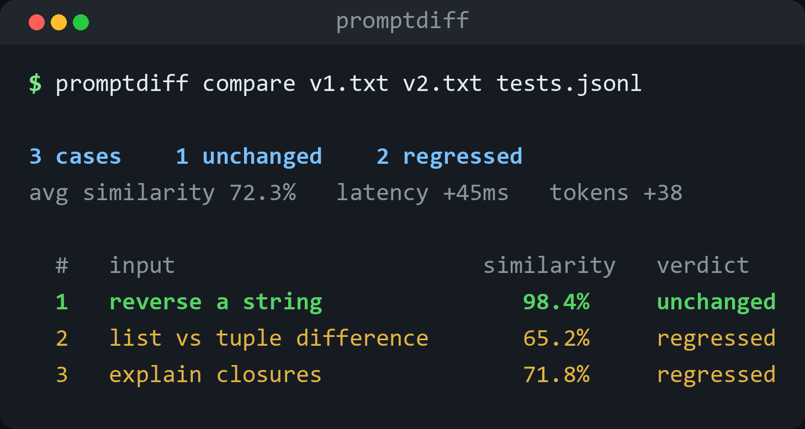

<div align="center">


[](https://python.org)
[](LICENSE)
[](https://github.com/he-yufeng/PromptDiff/actions)

[**Quick Start**](#quick-start) · [**Usage**](#usage) · [**How It Works**](#how-it-works) · [中文](README.zh-CN.md)

</div>

<p align="center"></p>

You changed your system prompt. Did it make things better or worse? PromptDiff runs both versions against your test cases, compares the outputs semantically, and tells you exactly what changed.

## Why PromptDiff?

Prompt engineering is iterative. You tweak a word, add an instruction, restructure the format — but how do you know if it actually helped? Manual A/B testing is slow and error-prone. PromptDiff automates the comparison:

- **Run both prompt versions** against the same test inputs through any OpenAI-compatible API
- **Semantic comparison** using sentence embeddings (or lexical fallback) to detect behavioral changes
- **LLM-as-judge** (optional) to classify changes as improvements or regressions
- **CI-friendly** — exit code 1 on regressions, JSON output for automation
- **Error-aware gating** - fail CI when either prompt version errors before trusting the diff
- **Rich terminal reports** with color-coded diffs, similarity scores, latency/token deltas

## Installation

```bash
pip install promptdiff

# with semantic similarity (recommended)
pip install "promptdiff[semantic]"
```

## Quick Start

Create two prompt files and a test cases file:

```bash
# prompt_v1.txt
You are a helpful coding assistant. Answer clearly and concisely.

# prompt_v2.txt
You are a senior engineer. Answer step by step. Always include code examples.

# test_cases.jsonl
{"input": "How do I reverse a string in Python?"}
{"input": "What's the difference between a list and a tuple?"}
{"input": "Explain closures."}
```

Run the comparison:

```bash
promptdiff compare prompt_v1.txt prompt_v2.txt test_cases.jsonl
```

Output:

```
┌─────────────────── PromptDiff Summary ───────────────────┐
│ 3 cases: 1 unchanged, 2 regressed                       │
│ avg similarity: 72.31%  |  avg latency delta: +45ms  |  │
│ avg token delta: +38                                     │
└──────────────────────────────────────────────────────────-┘

 #  │   │ Input                                │ Similarity │ Latency │ Tokens
  2 │ - │ What's the difference between a li... │     65.2%  │  +120ms │   +52
  3 │ - │ Explain closures.                     │     71.8%  │   +30ms │   +41
```

## Usage

### Basic comparison

```bash
promptdiff compare prompt_a.txt prompt_b.txt tests.jsonl
```

### Validate inputs without calling an LLM

```bash
promptdiff validate prompt_a.txt tests.jsonl --min-cases 5
```

This checks that the prompt is non-empty and that JSON/JSONL/YAML test cases have valid `input` fields before a CI job spends money on model calls.

### With LLM-as-judge

When outputs differ, use an LLM judge to decide if the change is an improvement or regression:

```bash
promptdiff compare prompt_a.txt prompt_b.txt tests.jsonl --judge
```

### Custom model / API

Works with any OpenAI-compatible API (Ollama, vLLM, LiteLLM, Together, etc.):

```bash
promptdiff compare prompt_a.txt prompt_b.txt tests.jsonl \
  --model llama-3.1-8b \
  --base-url http://localhost:11434/v1
```

### CI integration

Fail the build if any regressions are detected:

```bash
promptdiff compare prompt_a.txt prompt_b.txt tests.jsonl \
  --fail-on-regression --fail-on-error --json-output results.json
```

Set practical budgets when a small number of changes is acceptable but cost or latency drift is not:

```bash
promptdiff compare prompt_a.txt prompt_b.txt tests.jsonl \
  --max-regression-rate 0.05 \
  --min-avg-similarity 0.90 \
  --max-error-rate 0.01 \
  --max-avg-latency-increase 150 \
  --max-avg-token-increase 20 \
  --json-output results.json
```

The command exits with code 1 when any configured budget is exceeded, and writes the gate result into JSON output.

### Markdown report for PR comments

Turn a saved results file into a Markdown summary you can paste into a PR comment or attach as a CI artifact. It is offline and never calls the model:

```bash
promptdiff compare prompt_a.txt prompt_b.txt tests.jsonl -o results.json
promptdiff report results.json -o report.md
```

Without `--output` the report goes to stdout, which is convenient for piping into a `gh pr comment` step. The report has a summary table, the regression-budget verdict, and the worst cases ordered by severity. Use `--top` to cap how many cases are listed.

Need JUnit XML for a test-report dashboard instead? Pass `--format junit` to regenerate it from the same saved results — no model calls, so you don't pay to compare twice:

```bash
promptdiff report results.json --format junit -o junit.xml
```

`report --check` re-applies the regression budgets recorded at compare time and exits non-zero if they failed. This lets one CI job run the expensive `compare` and upload `results.json`, while a later cheap job posts the comment and gates the build offline:

```bash
promptdiff report results.json -o report.md --check   # exits 1 if a budget failed
```

Each regression is also graded by severity so you can tell a near-miss from a rewrite at a glance. The grade is based on how far the output similarity fell below the threshold the run used: minor (just under), moderate, or major; errored cases are always major. The report shows the per-case grade plus a one-line breakdown like `Severity: 1 major, 2 moderate`. Because the threshold is recorded in the results JSON, `report` reproduces the same grades offline.

### Adjust sensitivity

Lower threshold = more permissive (fewer false regressions):

```bash
promptdiff compare prompt_a.txt prompt_b.txt tests.jsonl --threshold 0.7
```

### Review the riskiest cases first

Terminal reports sort by severity by default: prompt run errors first, then the lowest-similarity regressions, then improvements and unchanged cases. If you want to preserve the original test-case order:

```bash
promptdiff compare prompt_a.txt prompt_b.txt tests.jsonl --sort input
```

### All options

```
Options:
  -m, --model TEXT          Model for running prompts (default: gpt-4o-mini)
  --base-url TEXT           Custom API base URL
  --api-key TEXT            API key (default: OPENAI_API_KEY env)
  -t, --threshold FLOAT     Similarity threshold for 'unchanged' (default: 0.85)
  --judge / --no-judge      Use LLM-as-judge for changed cases
  --judge-model TEXT        Judge model (default: gpt-4o-mini)
  -v, --verbose             Show detailed output for changed cases
  --show-unchanged          Include unchanged cases in report
  -o, --json-output PATH    Write JSON results to file
  -c, --concurrency INT     Max concurrent API calls (default: 5)
  --no-semantic             Use lexical similarity instead of embeddings
  --fail-on-regression      Exit code 1 if regressions found
  --fail-on-error           Exit code 1 if any prompt run errors
  --max-regression-rate FLOAT
  --min-avg-similarity FLOAT
  --max-error-rate FLOAT
  --max-avg-latency-increase FLOAT
  --max-avg-token-increase FLOAT
```

## Test Case Formats

PromptDiff supports multiple formats for test inputs:

| Format | Example |
|--------|---------|
| `.jsonl` | `{"input": "your question"}` per line |
| `.json` | `["q1", "q2"]` or `[{"input": "q1"}]` |
| `.yaml` | List of strings or objects with `input` key |
| `.txt` | One test case per line |

## Python API

```python
import asyncio
from promptdiff import PromptRunner, PromptDiff, DiffReport
from promptdiff.runner import RunConfig

config = RunConfig(model="gpt-4o-mini")
runner = PromptRunner(config)

prompt_a = "You are helpful."
prompt_b = "You are a senior engineer. Be detailed."
inputs = ["How do I sort a list in Python?", "What is a mutex?"]

results_a = asyncio.run(runner.run_batch(prompt_a, inputs))
results_b = asyncio.run(runner.run_batch(prompt_b, inputs))

differ = PromptDiff(threshold=0.85)
diffs, summary = differ.compare_batch(results_a, results_b)

report = DiffReport()
report.print_full(diffs, summary, verbose=True)
```

## How It Works

1. **Run**: Both prompts are sent to the LLM with each test input (concurrently, with rate limiting)
2. **Compare**: Outputs are compared using semantic similarity (sentence-transformers) or lexical similarity (Jaccard)
3. **Classify**: Cases below the similarity threshold are marked as "changed". Optionally, an LLM judge decides if the change is an improvement or regression
4. **Report**: Results are displayed with color-coded terminal output and optional JSON export

JSON output includes judge verdicts and per-side run errors, so CI jobs can fail loudly instead of hiding API failures behind an empty diff.

## Development

```bash
git clone https://github.com/he-yufeng/PromptDiff.git
cd PromptDiff
python -m venv .venv && source .venv/bin/activate
pip install -e ".[dev,semantic]"
pytest
```

## Related projects

- [TokenTracker](https://github.com/he-yufeng/TokenTracker) — a drop-in LLM cost tracker
- [BatchLLM](https://github.com/he-yufeng/BatchLLM) — batch processing for LLM APIs

## License

MIT
